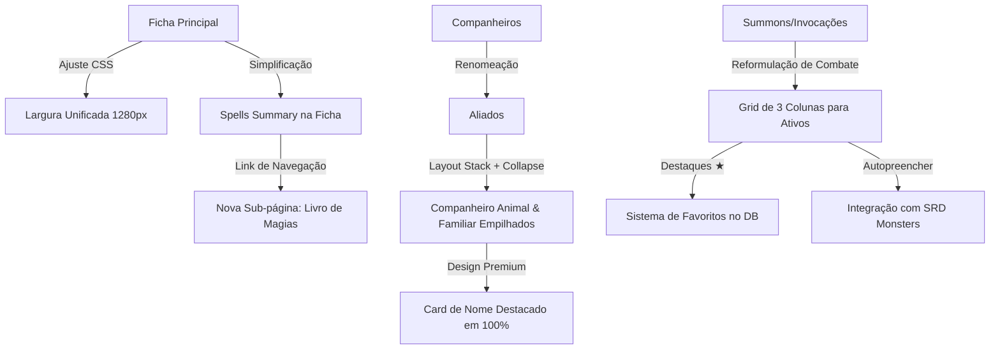

# Plano de Melhorias e Backlog da Ficha de Personagem

Este documento detalha e aprimora tecnicamente as melhorias para a ficha de personagem (sub-páginas, aliados, magias e invocações) em `dd3esheet`. Ele serve como guia para a implementação ordenada e de alta qualidade dessas features.

---

## 🚀 Resumo das Tarefas e Arquitetura



---

## 1. Padronizar Largura das Sub-páginas (`max-width: 1280px`)

### Problema Atual
A ficha principal (`character.html`) utiliza a classe `.sheet` que possui `max-width: 1280px`. Porém, as sub-páginas de Companheiros, Recursos Diários e Reputação usam sub-classes como `.companions-sheet` e `.sheet-utility` que limitam o tamanho horizontal a `1180px`. Isso causa um "soluço" visual desagradável (encolhimento horizontal de 100px) ao navegar pelas abas superiores.

### Solução Proposta
Unificar a largura de todas as telas em `1280px`. Isso dará mais espaço para grids complexos de aliados e tabelas de recursos.

### Detalhes de Implementação
* **CSS (`dd3esheet/static/css/character_sheet.css`):**
  Alterar as regras `.companions-sheet` e `.sheet-utility` para herdar ou definir explicitamente `max-width: 1280px`:
  ```css
  .companions-sheet,
  .sheet-utility {
      max-width: 1280px; /* Igualado a .sheet */
  }
  ```
* **HTML/Templates:** 
  Garantir que as seções internas aproveitem o espaço extra de forma harmônica através de grid layouts responsivos.

---

## 2. Nova Sub-página: "Livro de Magias" e Simplificação da Ficha Base

### Nome Proposto: **"Livro de Magias"** (ou **"Grimório & Preces"**)
* **Por que este nome?** D&D 3.5 possui conjuradores arcanos baseados em grimórios (Mago), conjuradores espontâneos (Feiticeiro, Bardo) e conjuradores divinos que preparam magias através de orações diárias (Clérigo, Druida, Paladino). "Livro de Magias" é um termo clássico, universal no RPG e perfeitamente compreensível para todas as classes.

### Parte A: Simplificação na Ficha Principal
* **Ficheiro:** `character/templates/character/partials/character_spells.html`
* **O que fica:** Apenas o **Resumo de Conjuração** (Classe, Nível de Conjurador, Habilidade-Chave, Falha Arcana) e o **Grid de Slots Diários** (níveis 0 a 9) com slots Por Dia, Bônus, Usadas e Restam. Essa tabela compacta é crucial para controle rápido no combate.
* **O que sai:** As duas tabelas verticais enormes de "Slots Preparados/Usados" (20 slots) e "Magias Conhecidas/Grimório" (36 slots) que alongam excessivamente a ficha base.
* **Navegação:** Adicionar um link/botão proeminente: `📖 Abrir Livro de Magias` que redireciona para a nova sub-página.

### Parte B: Nova Sub-página "Livro de Magias"
* **URL:** `/character/<pk>/spellbook/`
* **View:** `spellbook(request, pk)` similar às outras sub-páginas auxiliares.
* **Layout do Template (`spellbook.html`):**
  1. **Cabeçalho:** Informações de conjurador e slots diários (reaproveitando o partial resumido).
  2. **Organização por Círculo (Nível):** Em vez de uma tabela única com 36 linhas misturadas, agrupar as magias por Círculo/Nível (Abas horizontais de 0 a 9 ou seções expansíveis estilo sanfona).
  3. **Tabela de Conhecidas:** Grid elegante com colunas `[ Nível | Magia | Escola | Alcance | CD | Notas | Ações ]`.
  4. **Seção de Preparação Eficiente:** Permitir marcar como "Preparada" para o dia com um checkbox rápido que atualiza a contagem do círculo via HTMX.

---

## 3. Renomear "Companheiros" para "Aliados"

### Problema Atual
"Companheiros" pode ser interpretado em português como os outros jogadores do grupo (os membros do grupo de aventureiros). No D&D 3.5, esta tela gerencia especificamente os asseclas, montarias, companheiros animais e familiares do próprio personagem.

### Solução Proposta
Renomear todas as menções públicas e de interface de "Companheiros" para **"Aliados"** (ou **"Aliados & Acompanhantes"**).
* Mantém a URL `/companions/` intacta no Django para compatibilidade e menor atrito de código, mas muda todos os rótulos de interface.
* **Onde mudar:**
  * O menu de abas principais de navegação superior em `character.html`, `daily_resources.html` e `reputation.html`.
  * O título `<h1>` da página em `companions.html` ("Aliados do Personagem").
  * O breadcrumb/title da aba do navegador.

---

## 4. Redesenho e Destaque do Nome do Aliado / Familiar

### Problema Atual
Atualmente, no layout flex de duas colunas, o campo `Nome` do animal ou familiar usa um `<input>` espremido em uma pequena caixa de grid, perdendo a imponência e o carinho que os jogadores têm por seus companheiros.

### Proposta de Design (Papel Físico / Premium)
Dar ao Nome uma linha inteira dedicada com tipografia premium:

```
┌────────────────────────────────────────────────────────────────────────┐
│  G A R R A   S O M B R I A                                             │ <- Fonte Cinzel, Bold, 24px, 100% width
│  Lobo Atroz (Companheiro Animal)                                       │ <- Itálico, EB Garamond, 14px, Cor Rubrica
├──────────────┬──────────────┬──────────────┬──────────────┬────────────┤
│  PV: 45 / 45 │  CA: 18      │  Desloc: 15m │  Inic: +2    │  RM: —     │ <- Atributos rápidos em linha horizontal
└──────────────┴──────────────┴──────────────┴──────────────┴────────────┘
```

* **Estilização CSS:**
  * O campo de input de Nome não terá bordas padrão; será uma linha tracejada elegante, com a fonte `'Cinzel'` de exibição, em letras maiúsculas.
  * O rótulo "Nome" fica flutuando discretamente abaixo ou sumirá dando lugar a um placeholder elegante.

---

## 5. Empilhamento e Toggle de Visibilidade (Animal vs Familiar)

### Problema Atual
As fichas de *Animal Companion* e *Familiar* estão dispostas lado a lado. Quase nenhum personagem em D&D 3.5 possui ambos ao mesmo tempo (Druida/Ranger tem animal; Mago/Feiticeiro tem familiar). Ter as duas visíveis simultaneamente polui o layout de quem joga e espreme os dados horizontalmente.

### Solução Proposta
* **Layout Stacked (Empilhado):** Mover as seções de lado a lado para um fluxo vertical de 100% da largura útil (1280px). Isso dá aos atributos e tabelas de ataques de cada criatura um espaço de folha de papel real, super espaçoso e confortável.
* **Toggle de Visibilidade Interativo:**
  * Adicionar um cabeçalho clicável do tipo acordeão para cada uma das duas seções: `🐾 Companheiro Animal` e `🧙‍♂️ Familiar`.
  * Se o jogador não tem um Companheiro Animal cadastrado (campo Nome vazio), a seção correspondente inicia automaticamente **Colapsada/Fechada**, mostrando apenas um botão sutil de `+ Cadastrar Companheiro Animal`.
  * O estado de colapso pode ser alternado dinamicamente via JS vanilla ultra-leve adicionando a classe `d-none` ou `.collapsed`:
    ```javascript
    function toggleSection(sectionId) {
        const sec = document.getElementById(sectionId);
        sec.classList.toggle('is-hidden');
    }
    ```

---

## 6. Reformulação Completa de Invocações (Summons) de Combate

As invocações são temporárias, rápidas e caóticas em combate. A interface atual em formato de tabela simples não ajuda na dinâmica de jogo rápida.

### 6a. Grid Responsivo de Combate (3 Cards por Linha)
Substituir a lista tabular de invocações por uma seção de cards de combate rápidos dispostos lado a lado:

```
┌───────────────────────────┐ ┌───────────────────────────┐ ┌───────────────────────────┐
│ ★ LOBO ATROZ      [Nv. 3] │ │ ★ ÁGUIA GIGANTE   [Nv. 4] │ │   ELEMENTAL FOGO  [Nv. 4] │
│ SNA III · ⏳ 4/5 Rodadas  │ │ SNA IV · ⏳ 2/5 Rodadas   │ │ SM IV · ⏳ 5/5 Rodadas    │
├───────────────────────────┤ ├───────────────────────────┤ ├───────────────────────────┤
│ PV: 37 / 37    CA: 14     │ │ PV: 26 / 26    CA: 15     │ │ PV: 30 / 30    CA: 16     │
│ Ataque: Mordida +8 (1d8+4)│ │ Atq: 2 Garras +7 (1d6+3)  │ │ Ataque: Pancada +6 (1d6)  │
├───────────────────────────┤ ├───────────────────────────┤ ├───────────────────────────┤
│ Habilidade: Derrubar (Trip)│ │ Habilidade: Agarrar (Grab)│ │ Habilidade: Queimar (Burn)│
└───────────────────────────┘ └───────────────────────────┘ └───────────────────────────┘
```

### 6b. Sistema de Favoritos e Destaques (★)
* **Modelagem:** Adicionar o campo `IsFavorite` ou `Highlighted` ao model `CharacterCompanion` ou criar um boolean em `CharacterSummon` para ordenar prioritariamente.
* **Migração:** Criar um model/campo para persistir quais invocações devem constar em destaque no painel principal de combate do jogador.
* **UX:** Um botão de estrela (★/☆) em cada invocação que executa um `hx-post` instantâneo para fixar/desfixar o card na visualização rápida do grid principal.

### 6c. Integração e Busca na Referência SRD (Monstros)
* **A Grande Automação:** Ao clicar em "Adicionar Invocação", fornecer um formulário com um campo de autocompletar que busca as criaturas da tabela `sdr.models.SdrMonster` (utilizando `.using('sdr')` no Django).
* **Fluxo:**
  1. O jogador seleciona "Lobo Atroz".
  2. O Django busca os dados estatísticos (HP, AC, Attacks, Damage, SpecialAbilities) diretamente do banco do SRD.
  3. Preenche automaticamente todos os dados básicos da ficha de invocação, deixando apenas o campo de "Rodadas Restantes" e "PV Atual" para o controle dinâmico do jogador.
* Isso elimina completamente a necessidade de digitar estatísticas de monstros manualmente em meio à sessão de RPG!

---

## 🛠 Plano de Desenvolvimento Recomendado (TDD)

Para garantir a robustez da aplicação, a implementação deve seguir as regras de **TDD** do projeto:

1. **Sprint 1: Layout e Visuais (Baixo Risco)**
   * Padronizar as larguras de tela para `1280px` no CSS.
   * Mudar os nomes de "Companheiros" para "Aliados" nos templates e menus.
   * Redesenhar o layout do Nome com fontes premium e 100% de largura horizontal.

2. **Sprint 2: Empilhamento e Interatividade (Médio Risco)**
   * Reorganizar o HTML de companheiros em fluxo vertical.
   * Implementar o sistema de toggle colapsável no frontend.
   * Escrever testes de views para garantir que o redirecionamento e permissões da aba continuam 100% corretos.

3. **Sprint 3: O Livro de Magias (Alto Impacto)**
   * Criar a URL e a view `spellbook`.
   * Migrar as tabelas densas de conhecidas/preparadas da ficha base para a nova sub-página.
   * Implementar o agrupamento visual de magias por Círculo (0 a 9) com accordion/abas.
   * **Testes:** Validar que requisições normais e HTMX na página de magias salvam e recalculam corretamente.

4. **Sprint 4: Summons de Batalha & SRD (Alta Complexidade/Premium)**
   * Criar migração para adicionar o campo booleano `Highlighted` (favoritos) às invocações.
   * Desenhar o grid responsivo de 3 colunas para summons ativos.
   * Desenvolver a integração do Django buscando monstros na base SDR usando `.using('sdr')` para autopreencher os novos summons cadastrados.
   * **Testes:** Testar unitariamente as buscas de monstros no banco SDR e os métodos de associação à ficha de personagem.
